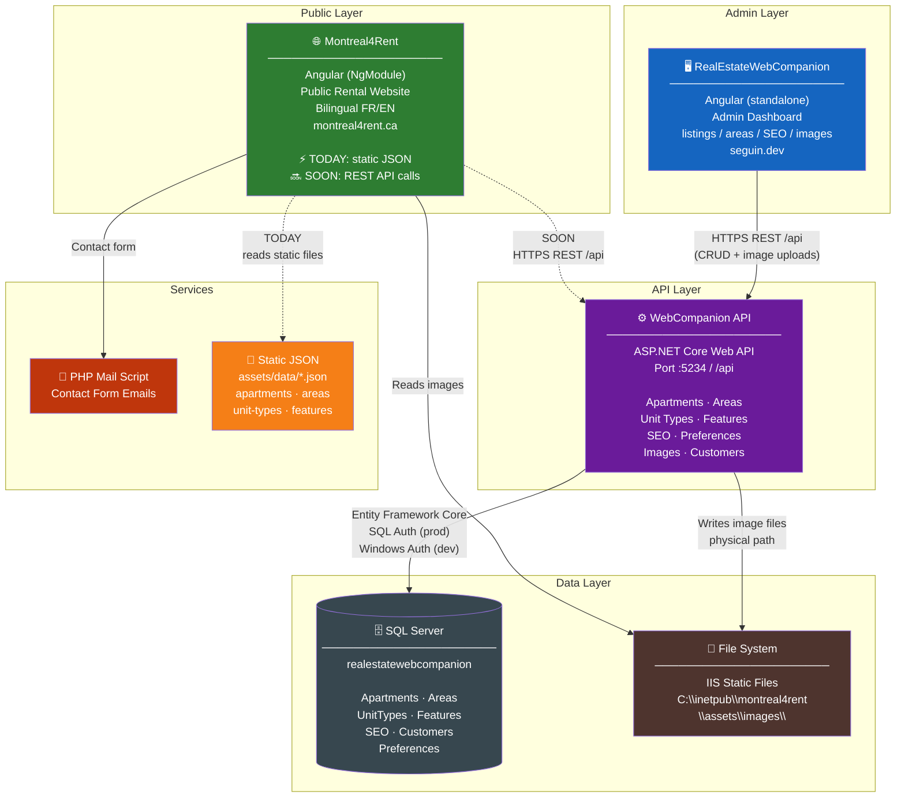

# High-Level Architecture Diagram

## Key Architectural Notes

- **WebCompanion → WebAPI**: Full CRUD admin flow. All data mutations go through the REST API, which persists to SQL Server. Images are uploaded via multipart POST and written directly to the IIS static folder.

- **The image bridge**: The API writes physical image files into `C:\inetpub\montreal4rent\assets\images\` — so uploaded images appear on the public site immediately without a redeploy.

- **Montreal4Rent today**: Decoupled from live data. It reads exported static JSON files — changes made via the admin don't appear until the JSON is regenerated and redeployed.

- **Montreal4Rent soon**: Once wired to the API, it will get live data directly — eliminating the static JSON pipeline and making listing changes appear instantly on the public site.
